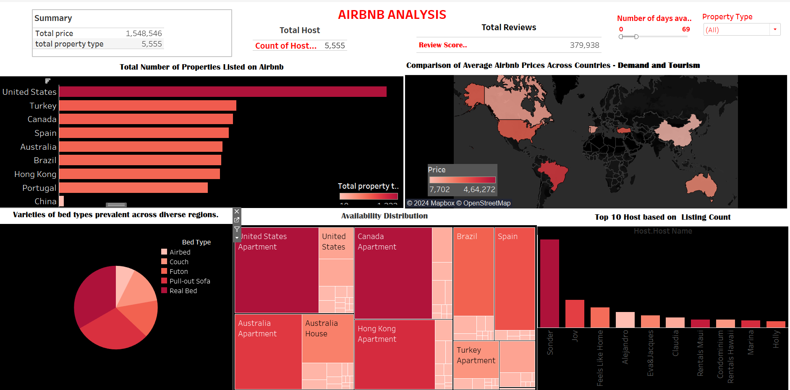
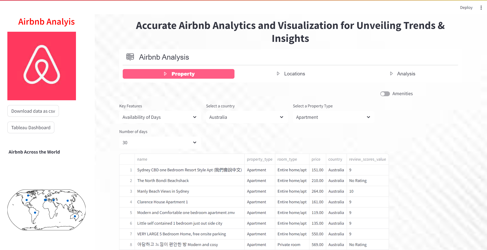
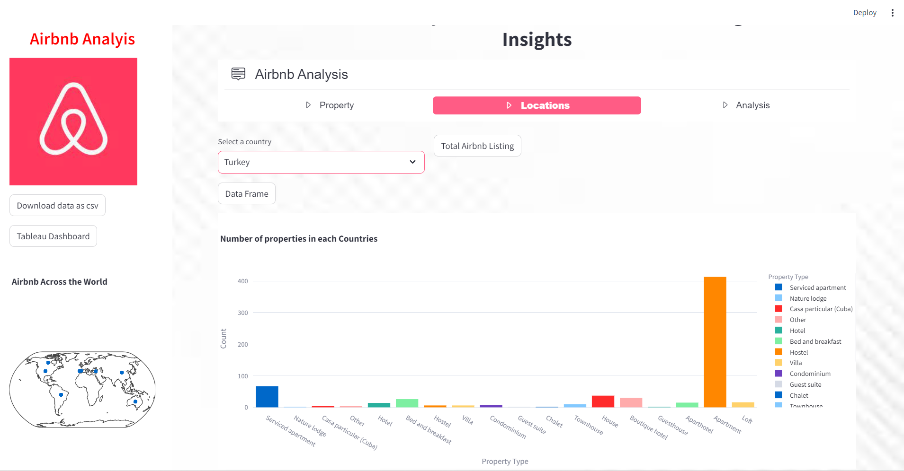
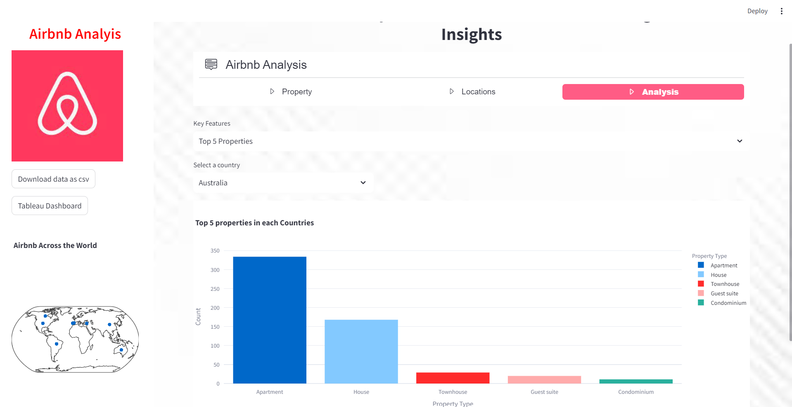
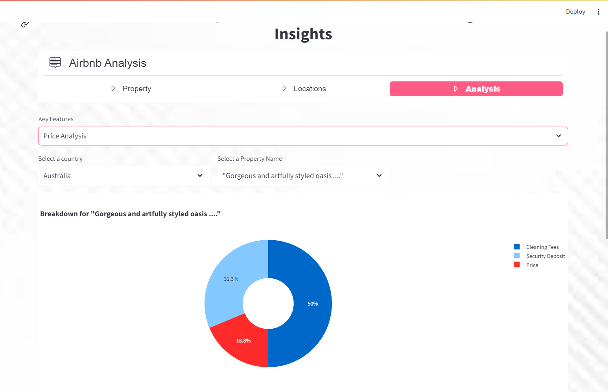

# AirbnbAnalysis #
### Description: ##
**The project begins by establishing a connection to MongoDB Atlas, facilitating data retrieval from the Airbnb dataset and executing queries for analysis. Subsequently, rigorous data cleaning procedures are implemented, addressing missing values, duplicates, and data type transformations to ensure data integrity and prepare the dataset for exploratory analysis. Finally, a Streamlit web application is developed, leveraging Airbnb's geospatial data to create interactive maps that enable users to explore listing distribution, prices, and ratings across diverse locations with ease and flexibility.**

## Introduction: ##
This project focuses on analyzing Airbnb data retrieved from MongoDB Atlas, emphasizing data cleaning, exploratory analysis, and geospatial visualization to provide insights into listing distribution and pricing trends across various locations. Through MongoDB integration and Streamlit web application development, the project aims to deliver an interactive platform for users to explore and understand the Airbnb dataset comprehensively.

### Libraries/Modules Required ###
- pymongo: Used for interacting with MongoDB databases.
- streamlit: Utilized for building interactive web applications.
- pandas: Employed for data manipulation and analysis.
- option_menu (from streamlit_option_menu): Potentially used for creating customized dropdown menus in Streamlit apps.
- plotly.express: Used for creating interactive visualizations.
- bson.decimal128.Decimal128: Utilized for handling decimal data types in MongoDB.

### Approach: ###

The approach for this project involves several key steps to achieve the outlined objectives:

* Establish MongoDB Connection and Data Retrieval: Begin by establishing a connection to MongoDB Atlas to access the Airbnb dataset. Utilize pymongo to efficiently retrieve the data needed for analysis.

* Data Cleaning and Preparation: Perform thorough data cleaning processes to address missing values, duplicates, and inconsistent data types. Ensure the dataset is prepared accurately for further analysis.

* Develop Interactive Geospatial Visualizations: Utilize Streamlit to develop a web application featuring interactive maps that showcase the distribution of Airbnb listings. Incorporate user-friendly features to allow exploration of prices, ratings, and other relevant factors.

* Conduct Price Analysis and Visualization: Utilize plotly.express to conduct in-depth analysis on pricing variations based on location, property type, and seasons. Develop dynamic plots and charts to visualize these insights effectively.

* Analyze Availability Patterns Across Seasons: Utilize suitable visualization techniques to analyze availability patterns, including occupancy rates and demand fluctuations across different seasons.

* Investigate Location-Based Insights: Extract and visualize data specific to regions or neighborhoods to gain insights into location-based trends and patterns.

* Create Interactive Visualizations: Develop interactive visualizations that enable users to filter and drill down into the data based on their preferences, enhancing the exploration experience.

* Build Comprehensive Dashboard: Utilize Tableau or Power BI to create a comprehensive dashboard that combines various visualizations to present key insights from the analysis. Incorporate interactive elements to facilitate user interaction and understanding.

By following this approach, the project aims to provide valuable insights into pricing variations, availability patterns, and location-based trends within the Airbnb dataset, ultimately enhancing decision-making processes for stakeholders.

### Conclusion: ###
In conclusion, this project offers comprehensive insights into Airbnb data through MongoDB integration, thorough data cleaning, interactive visualization, and dashboard creation, facilitating informed decision-making for stakeholders.

## Project Preview: ##

